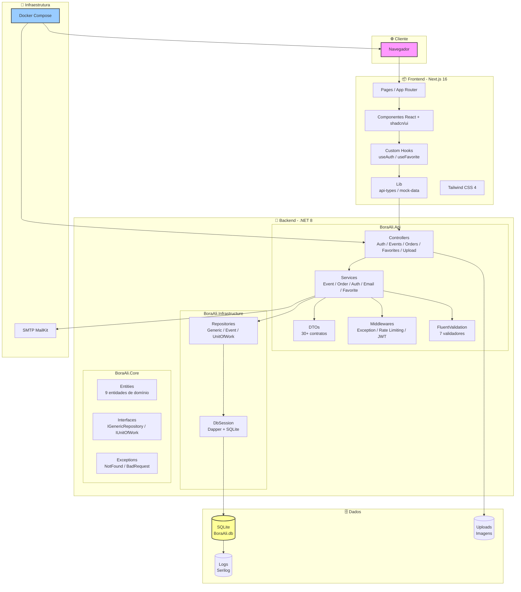

# 🎫 BoraAli — Plataforma de Eventos e Ingressos

<p align="center">
  
  
  
  
  
  
  
</p>

<p align="center">
  
  
  
  
</p>

**BoraAli** é uma plataforma full-stack para descoberta, criação e venda de ingressos para eventos. Conecta organizadores e público em uma experiência unificada, com controle de estoque em tempo real, autenticação JWT, check-in via QR Code e dashboard analítico para organizadores.

---

## 📋 Índice

- [Visão Geral](#-visão-geral)
- [Stack Tecnológica](#-stack-tecnológica)
- [Arquitetura](#-arquitetura)
- [Funcionalidades](#-funcionalidades)
- [Modelo de Dados](#-modelo-de-dados)
- [API Endpoints](#-api-endpoints)
- [Segurança](#-segurança)
- [Fluxos da Aplicação](#-fluxos-da-aplicação)
- [Execução Local](#-execução-local)
- [Docker](#-docker)
- [Testes](#-testes)
- [Documentação](#-documentação)
- [Estrutura do Projeto](#-estrutura-do-projeto)
- [Decisões Técnicas](#-decisões-técnicas)
- [Membros do Projeto](#-membros-do-projeto)

---

## 📖 Visão Geral

### O Problema

Organizadores de eventos enfrentam planilhas desorganizadas, confirmações manuais por WhatsApp, risco de overbooking e nenhuma visibilidade em tempo real. O público precisa vasculhar redes sociais e sites fragmentados para encontrar eventos interessantes.

### A Solução

**BoraAli** unifica a experiência: organizadores cadastram eventos com múltiplos tipos de ingresso, controlam estoque em tempo real, gerenciam pedidos e acompanham métricas. O público navega por categorias, pesquisa, visualiza detalhes e compra ingressos em poucos cliques.

---

## 🏗️ Stack Tecnológica

| Camada | Tecnologia | Versão | Propósito |
|--------|------------|--------|-----------|
| **Frontend** | Next.js | 16.2.6 (App Router) | Framework React com SSR/SSG |
| | React | 19 | Biblioteca de UI |
| | TypeScript | 5.7.3 | Tipagem estática |
| | Tailwind CSS | 4 | Estilização utility-first |
| | shadcn/ui | — | Componentes acessíveis (Radix UI) |
| | Lucide React | — | Ícones |
| | React Hook Form + Zod | — | Formulários e validação |
| | Recharts | — | Gráficos (dashboard) |
| | date-fns | — | Manipulação de datas |
| | Sonner | — | Notificações toast |
| | next-themes | — | Tema claro/escuro |
| **Backend** | .NET | 8.0 | Runtime principal |
| | C# | 12 | Linguagem |
| | Dapper | 2.1.28 | Micro-ORM |
| | SQLite (Microsoft.Data.Sqlite) | 8.0 | Banco de dados embarcado |
| | AutoMapper | 13+ | Mapeamento DTO ↔ Entidade |
| | FluentValidation | 11+ | Validação de requisições |
| | Serilog | 8.0 | Logging estruturado |
| | Swashbuckle (Swagger) | 6.6+ | Documentação OpenAPI |
| | JWT Bearer | — | Autenticação stateless |
| | BCrypt.Net-Next | 4.0.3 | Hash de senhas |
| | MailKit | 4+ | Envio de e-mails SMTP |
| | QRCoder | 1+ | Geração de QR Code |
| | DbUp | 5+ | Migrations de banco |
| **Testes** | xUnit + Moq + FluentAssertions | — | Testes unitários (backend) |
| | Vitest + Testing Library | — | Testes (frontend) |
| **Infra** | Docker Compose | — | Containerização |
| | pnpm | — | Gerenciador de pacotes |

---

## 🏛️ Arquitetura

O projeto segue **Clean Architecture** com 3 camadas no backend e frontend Next.js 16 com App Router:

### Diagrama de Arquitetura



### Backend — 3 Camadas

```
┌─────────────────────────────────────────────────┐
│              BoraAli.Api (Apresentação)          │
│  Controllers → DTOs → Services → Middlewares     │
│  AutoMapper · FluentValidation · Rate Limiting   │
├─────────────────────────────────────────────────┤
│          BoraAli.Infrastructure (Infraestrutura)  │
│  Repositories · UnitOfWork · DbSession · SQLite  │
│  ExceptionMiddleware                             │
├─────────────────────────────────────────────────┤
│              BoraAli.Core (Domínio)               │
│  Entities · Interfaces · Custom Exceptions       │
└─────────────────────────────────────────────────┘
```

### Princípios Aplicados

- **SOLID** — cada classe com responsabilidade única
- **Repository Pattern** — abstração do acesso a dados
- **Unit of Work** — transações consistentes entre múltiplos repositórios
- **Dependency Injection** — desacoplamento entre camadas
- **Clean Architecture** — dependências apontam para o centro (Core)
- **DTO Pattern** — separação entre modelo de domínio e contrato da API
- **Middleware Pattern** — pipeline de tratamento de erros, rate limiting, segurança

---

## ✨ Funcionalidades

### Público (sem autenticação)
- Navegar por eventos em destaque
- Filtrar por categoria, cidade ou termo de busca
- Visualizar detalhes completos do evento (data, local, tipos de ingresso, preços)
- Página pública de check-in via QR Code

### Usuário Autenticado (Cliente)
- Registrar-se e fazer login (JWT + BCrypt)
- Comprar ingressos com validação de disponibilidade em tempo real
- Visualizar histórico de pedidos
- Cancelar ou solicitar reembolso de pedidos
- Favoritar eventos e seguir organizadores
- Check-in via QR Code (público ou autenticado)

### Organizador
- Criar eventos com múltiplos tipos de ingresso
- Upload de imagem do evento (validação: 5MB, .jpg/.jpeg/.png/.webp)
- Publicar evento (valida: rascunho, 24h no futuro, ao menos 1 ingresso ativo)
- Editar e excluir eventos próprios
- Dashboard com estatísticas (receita, ingressos vendidos, por tipo, por evento)
- Relatório de vendas detalhado por evento
- Check-in de participantes via QR Code

### Admin
- Gerenciamento de usuários
- Moderação de conteúdo

---

## 🗄️ Modelo de Dados

### Entidades

| Entidade | Descrição |
|----------|-----------|
| [`User`](backend/BoraAli.Core/Entities/User.cs:6) | Usuários (Cliente, Organizador, Admin) |
| [`Category`](backend/BoraAli.Core/Entities/Category.cs:6) | Categorias de eventos (Shows, Teatro, Esportes, etc.) |
| [`Event`](backend/BoraAli.Core/Entities/Event.cs:6) | Eventos com dados completos (data, local, cidade, status) |
| [`TicketType`](backend/BoraAli.Core/Entities/TicketType.cs:6) | Tipos de ingresso por evento (Pista, VIP, Camarote, etc.) |
| [`Order`](backend/BoraAli.Core/Entities/Order.cs:6) | Pedidos com status (Pending → Confirmed → Used \| Cancelled \| Refunded) |
| [`OrderItem`](backend/BoraAli.Core/Entities/OrderItem.cs:6) | Itens do pedido (ingressos individuais) |
| [`Coupon`](backend/BoraAli.Core/Entities/Coupon.cs:6) | Cupons de desconto (globais ou por evento) |
| [`EventFavorite`](backend/BoraAli.Core/Entities/EventFavorite.cs:6) | Favoritos de eventos |
| [`OrganizerFollow`](backend/BoraAli.Core/Entities/OrganizerFollow.cs:6) | Seguidores de organizadores |

### Diagrama ER (Simplificado)

```
User ──┬── Event (organizador)
       ├── Order (cliente)
       ├── EventFavorite
       └── OrganizerFollow (follower/organizer)

Category ── Event

Event ──┬── TicketType
        ├── Order
        └── Coupon

TicketType ── OrderItem

Order ──┬── OrderItem
        └── User

Coupon ── Event (opcional)
```

### Status dos Eventos

`Draft` → `Published` → `Cancelled` | `Finished`

### Status dos Pedidos

`Pending` → `Confirmed` → `Used` | `Cancelled` | `Refunded`

### Características do SQLite

- WAL mode (`PRAGMA journal_mode=WAL`) para concorrência de leitura/escrita
- Foreign keys habilitadas (`PRAGMA foreign_keys=ON`)
- Migrations via DbUp (scripts SQL embarcados)
- Concorrência segura: `UPDATE ... WHERE AvailableQuantity >= @Qty` (otimista)

---

## 🌐 API Endpoints

### Autenticação (`/api/auth`)

| Método | Rota | Descrição | Autenticação | Rate Limit |
|--------|------|-----------|--------------|------------|
| POST | `/api/auth/register` | Registrar novo usuário | ❌ | 5 req/min |
| POST | `/api/auth/login` | Login (retorna JWT) | ❌ | 5 req/min |
| GET | `/api/auth/me` | Dados do usuário logado | ✅ | — |

### Eventos (`/api/events`)

| Método | Rota | Descrição | Autenticação |
|--------|------|-----------|--------------|
| GET | `/api/events` | Listar eventos (paginado, filtrável) | ❌ |
| GET | `/api/events/featured` | Eventos em destaque | ❌ |
| GET | `/api/events/categories` | Listar categorias | ❌ |
| GET | `/api/events/{id}` | Detalhes do evento + ingressos | ❌ |
| POST | `/api/events` | Criar evento (JSON) | ✅ (Organizador) |
| POST | `/api/events/with-image` | Criar evento com imagem (multipart) | ✅ (Organizador) |
| PUT | `/api/events/{id}` | Atualizar evento | ✅ (Organizador) |
| DELETE | `/api/events/{id}` | Excluir evento | ✅ (Organizador) |
| GET | `/api/events/my-events` | Meus eventos (paginado) | ✅ (Organizador) |
| GET | `/api/events/stats` | Dashboard analytics | ✅ (Organizador) |
| POST | `/api/events/{id}/publish` | Publicar evento | ✅ (Organizador) |
| GET | `/api/events/{id}/sales-summary` | Relatório de vendas | ✅ (Organizador) |

### Pedidos (`/api/orders`)

| Método | Rota | Descrição | Autenticação | Rate Limit |
|--------|------|-----------|--------------|------------|
| POST | `/api/orders` | Criar pedido | ✅ | 10 req/min |
| GET | `/api/orders/{id}` | Detalhes do pedido | ✅ | — |
| GET | `/api/orders` | Listar pedidos do usuário | ✅ | — |
| POST | `/api/orders/{id}/cancel` | Cancelar pedido | ✅ | — |
| POST | `/api/orders/{id}/refund` | Solicitar reembolso | ✅ | — |
| POST | `/api/orders/{id}/confirm-payment` | Simular pagamento (Pix) | ✅ | — |
| POST | `/api/orders/checkin` | Check-in (organizador) | ✅ (Organizador) | 5 req/min |
| POST | `/api/orders/public-checkin` | Check-in público | ❌ | 5 req/min |
| POST | `/api/orders/validate-coupon` | Validar cupom | ✅ | — |
| DELETE | `/api/orders/{id}` | Excluir pedido (cancelado/reembolsado) | ✅ | — |

### Favoritos (`/api/favorites`)

| Método | Rota | Descrição | Autenticação |
|--------|------|-----------|--------------|
| POST | `/api/favorites/events/{eventId}/toggle` | Favoritar/desfavoritar evento | ✅ |
| GET | `/api/favorites/events/{eventId}/status` | Status do favorito | ✅ |
| GET | `/api/favorites/events` | Eventos favoritados | ✅ |
| POST | `/api/favorites/organizers/{organizerId}/toggle` | Seguir/deixar de seguir | ✅ |
| GET | `/api/favorites/organizers/{organizerId}/status` | Status do seguimento | ✅ |
| GET | `/api/favorites/organizers` | Organizadores seguidos | ✅ |

### Upload (`/api/upload`)

| Método | Rota | Descrição | Autenticação | Rate Limit |
|--------|------|-----------|--------------|------------|
| POST | `/api/upload/image` | Upload de imagem (5MB, .jpg/.png/.webp) | ✅ | 20 req/min |

### Utilitários

| Método | Rota | Descrição |
|--------|------|-----------|
| GET | `/health` | Health check |
| GET | `/` | Redireciona para Swagger |

### Estrutura de Resposta Padrão

```json
{
  "success": true,
  "message": "Operação realizada com sucesso",
  "data": { ... },
  "errors": null
}
```

Respostas paginadas incluem:

```json
{
  "success": true,
  "data": {
    "items": [ ... ],
    "pageNumber": 1,
    "pageSize": 10,
    "totalCount": 42,
    "totalPages": 5
  }
}
```

---

## 🔒 Segurança

### Autenticação e Autorização

- **JWT Bearer** com claims de Role (Cliente, Organizador, Admin)
- **BCrypt** (11 rounds) para hash de senhas
- **Políticas de autorização**: `ClienteOnly`, `OrganizadorOnly`, `ClienteOrOrganizador`
- Token expira em 8 horas

### Rate Limiting

| Política | Limite | Escopo |
|----------|--------|--------|
| Global | 100 req/min | Todas as rotas |
| Login | 5 req/min | `/api/auth/login`, `/api/auth/register` |
| Orders | 10 req/min | `/api/orders` (POST) |
| Upload | 20 req/min | `/api/upload/image` |
| CheckIn | 5 req/min | `/api/orders/checkin`, `/api/orders/public-checkin` |

### Headers de Segurança (Frontend)

- Content-Security-Policy
- X-Frame-Options (DENY)
- Strict-Transport-Security
- X-Content-Type-Options (nosniff)
- Referrer-Policy

### Validação

- **FluentValidation** (backend): 7 validadores (CreateEvent, UpdateEvent, CreateTicketType, RegisterUser com CPF, Login, CreateOrder, CreateOrderItem)
- **Zod** (frontend): validação de formulários

### Concorrência

Controle de estoque otimista com `UPDATE ... WHERE AvailableQuantity >= @Qty` dentro de transações, garantindo que não haja venda de ingressos além do disponível mesmo sob concorrência.

### Tratamento de Erros

- [`ExceptionMiddleware`](backend/BoraAli.Infrastructure/Middleware/ExceptionMiddleware.cs) global
- Exceções customizadas: [`NotFoundException`](backend/BoraAli.Core/Exceptions/CustomExceptions.cs:6), [`BadRequestException`](backend/BoraAli.Core/Exceptions/CustomExceptions.cs:14)
- Logging estruturado com Serilog (console + arquivo diário)

---

## 🔄 Fluxos da Aplicação

### 1. Descoberta de Eventos (sem autenticação)
- Usuário acessa a landing page → vê hero section com destaques
- Navega por categorias, pesquisa por termo ou cidade
- Visualiza detalhes do evento com tipos de ingresso e preços

### 2. Autenticação
- Usuário cria conta com nome, email, CPF e senha
- Senha hashada com BCrypt antes de persistir
- Login retorna JWT (8h de validade) no header `Authorization: Bearer {token}`

### 3. Compra de Ingressos
- Usuário autenticado seleciona ingressos e quantidades (máx. 5 por evento)
- Envia pedido → sistema valida disponibilidade com atomic UPDATE
- Calcula totais, aplica cupom (se houver), gera código único (`BA-YYYYMMDD-XXXXXXXX`)
- Confirma pagamento (simulação Pix) → envia e-mail com confirmação

### 4. Check-in via QR Code
- Organizador ou usuário acessa página de check-in
- Insere código do pedido → sistema valida e marca como `Used`

### 5. Gerenciamento de Eventos (Organizadores)
- Criar evento com múltiplos tipos de ingresso
- Upload de imagem com validação
- Publicar (valida: rascunho, 24h futuro, ao menos 1 ingresso)
- Dashboard com receita total, ingressos vendidos, por tipo, por evento

### 6. Favoritos e Seguidores
- Usuário pode favoritar eventos e seguir organizadores
- Visualiza lista de eventos favoritos e organizadores seguidos

---

## 🚀 Execução Local

### Pré-requisitos

- [Node.js 20+](https://nodejs.org/) (para o frontend)
- [pnpm](https://pnpm.io/) (recomendado) ou npm
- [.NET 8 SDK](https://dotnet.microsoft.com/download/dotnet/8.0) (para o backend)

### Passos Rápidos

```bash
# 1. Clone o repositório
git clone https://github.com/andreyabrantes/engenharia-software.git
cd engenharia-software

# 2. Execute o backend
cd backend/BoraAli.Api
dotnet restore
dotnet run
# API em http://localhost:5188 (HTTP) | https://localhost:7144 (HTTPS)
# Swagger em http://localhost:5188/swagger

# 3. Em outro terminal, execute o frontend
cd ../..
pnpm install   # ou npm install
pnpm run dev   # ou npm run dev
# Frontend em http://localhost:3000
```

> **Nota:** O banco SQLite é criado automaticamente na primeira execução via DbUp migrations. Não é necessário configurar banco de dados.

### Variáveis de Ambiente (Backend)

| Variável | Descrição | Default |
|----------|-----------|---------|
| `JWT_SECRET` | Chave secreta para assinar tokens JWT | (obrigatório) |
| `JWT_ISSUER` | Emissor do JWT | `BoraAli` |
| `JWT_AUDIENCE` | Audiência do JWT | `BoraAliApp` |
| `SMTP_HOST` | Servidor SMTP | — |
| `SMTP_PORT` | Porta SMTP | — |
| `SMTP_USER` | Usuário SMTP | — |
| `SMTP_PASS` | Senha SMTP | — |
| `SMTP_FROM` | E-mail remetente | — |
| `CORS_ORIGINS` | Origens permitidas (separadas por `;`) | `http://localhost:3000` |

---

## 🐳 Docker

### Docker Compose

```bash
docker-compose up --build
```

- **API**: `http://localhost:5188`
- **Frontend**: `http://localhost:3000`
- Volumes: `data/` (SQLite), `logs/` (Serilog), `uploads/` (imagens)

### Dockerfiles

- [`Dockerfile.frontend`](Dockerfile.frontend) — Multi-stage build (Node.js 22 Alpine)
- [`backend/Dockerfile`](backend/Dockerfile) — .NET 8 runtime

---

## 🧪 Testes

### Backend (xUnit + Moq + FluentAssertions)

```bash
cd backend
dotnet test
```

21 testes unitários cobrindo:
- **EventService** (7): CRUD, paginação, featured, busca
- **AuthService** (7): registro, login, duplicidade de email, token JWT
- **OrderService** (7): criação, consulta, cancelamento, validação de estoque

### Frontend (Vitest + Testing Library)

```bash
pnpm test          # Executar testes
pnpm test:watch    # Modo watch
pnpm test:coverage # Relatório de cobertura
```

---

## 📚 Documentação

A documentação completa está disponível em duas formas:

### Documentos Markdown (`docs/`)

| Documento | Descrição |
|-----------|-----------|
| [`docs/visao.md`](docs/visao.md) | Visão do produto, público-alvo, funcionalidades (F1-F10) |
| [`docs/arquitetura.md`](docs/arquitetura.md) | Arquitetura com diagrama UML de classes e ER |
| [`docs/roadmap.md`](docs/roadmap.md) | Roadmap com 21 specs em 3 fases (Foundation ✅, Enhancements 🔄, Expansion 📋) |
| [`docs/adr.md`](docs/adr.md) | 12 Architecture Decision Records |
| [`docs/casos-de-uso.md`](docs/casos-de-uso.md) | 16 casos de uso com fluxos detalhados + matriz de rastreabilidade |
| [`docs/requisitos-nao-funcionais.md`](docs/requisitos-nao-funcionais.md) | 45 requisitos não-funcionais em 8 categorias + matriz RNF → ADR |
| [`docs/padroes-de-projeto.md`](docs/padroes-de-projeto.md) | Padrões de projeto com exemplos de código |
| [`docs/seguranca_ciclo.md`](docs/seguranca_ciclo.md) | Segurança no ciclo de desenvolvimento (3 gates) |
| [`docs/licoes-aprendidas.txt`](docs/licoes-aprendidas.txt) | Lições aprendidas durante o desenvolvimento |
| [`docs/diagramas-uml.md`](docs/diagramas-uml.md) | Diagramas UML detalhados |
| [`docs/modelo-entidade-relacionamento.md`](docs/modelo-entidade-relacionamento.md) | Modelo ER completo |
| [`docs/plano_iteracao.md`](docs/plano_iteracao.md) | Plano de iteração |
| [`docs/registro_divida_tecnica.md`](docs/registro_divida_tecnica.md) | Registro de dívida técnica |
| [`docs/analise_arquitetura.md`](docs/analise_arquitetura.md) | Análise de arquitetura |
| [`docs/fluxo_manutencao.md`](docs/fluxo_manutencao.md) | Fluxo de manutenção |
| [`docs/operacao.md`](docs/operacao.md) | Guia de operação |
| [`docs/topologia_times.md`](docs/topologia_times.md) | Topologia de times |
| [`docs/guia-apresentacao.md`](docs/guia-apresentacao.md) | Guia de apresentação |

### Páginas Web (`/specs`)

Acesse `http://localhost:3000/specs` para navegar pela documentação interativamente.

---

## 📁 Estrutura do Projeto

```
/
├── app/                              # Frontend Next.js 16 (App Router)
│   ├── page.tsx                      # Home page (eventos, hero, newsletter)
│   ├── layout.tsx                    # Root layout (header, footer, theme)
│   ├── globals.css                   # Estilos globais + variáveis CSS
│   ├── login/page.tsx                # Login/Register
│   ├── evento/[id]/page.tsx          # Detalhes do evento
│   ├── checkout/[id]/page.tsx        # Checkout
│   ├── criar-evento/page.tsx         # Criar evento (organizador)
│   ├── editar-evento/[id]/page.tsx   # Editar evento
│   ├── meus-eventos/page.tsx         # Dashboard organizador
│   ├── meus-pedidos/page.tsx         # Histórico de pedidos
│   ├── favoritos/page.tsx            # Eventos favoritados
│   ├── seguindo/page.tsx             # Organizadores seguidos
│   ├── checkin/page.tsx              # Página de check-in
│   └── specs/                        # Páginas de documentação
│       ├── page.tsx                  # Índice de specs
│       ├── visao/page.tsx
│       ├── arquitetura/page.tsx
│       ├── roadmap/page.tsx
│       ├── casos-de-uso/page.tsx
│       ├── requisitos-nao-funcionais/page.tsx
│       ├── licoes/page.tsx
│       └── adr/page.tsx
├── components/                       # Componentes React
│   ├── header.tsx                    # Header com navegação e auth
│   ├── footer.tsx                    # Footer
│   ├── hero-section.tsx              # Hero com carrossel
│   ├── event-card.tsx                # Card de evento
│   ├── events-grid.tsx               # Grid com filtros
│   ├── ticket-selector.tsx           # Seleção de ingressos
│   ├── checkout-form.tsx             # Formulário de checkout
│   ├── error-boundary.tsx            # Error boundary
│   ├── theme-provider.tsx            # Tema claro/escuro
│   └── ui/                           # shadcn/ui components (60+)
├── hooks/                            # Custom hooks
│   ├── use-auth.ts                   # Hook de autenticação (login, logout, token)
│   ├── use-favorite.ts               # Hook de favoritos e seguidores
│   ├── use-toast.ts                  # Hook de notificações
│   └── use-mobile.ts                 # Hook de detecção mobile
├── lib/                              # Utilitários e tipos
│   ├── api-types.ts                  # Tipos da API + mappers (resolveImageUrl, mapApiEventToLegacy)
│   ├── mock-data.ts                  # Dados mockados (fallback)
│   └── utils.ts                      # Utilitários (cn)
├── backend/                          # Backend .NET 8
│   ├── BoraAli.slnx                  # Solução
│   ├── BoraAli.Core/                 # Camada de domínio
│   │   ├── Entities/                 # 9 entidades
│   │   ├── Interfaces/               # IGenericRepository, IEventRepository, IUnitOfWork, IDapperExecutor
│   │   └── Exceptions/               # NotFoundException, BadRequestException
│   ├── BoraAli.Infrastructure/       # Persistência
│   │   ├── Data/DbSession.cs         # Sessão SQLite
│   │   ├── Repositories/             # GenericRepository, EventRepository, UnitOfWork
│   │   └── Middleware/               # ExceptionMiddleware
│   ├── BoraAli.Api/                  # API REST
│   │   ├── Controllers/              # 5 controllers (Auth, Events, Orders, Favorites, Upload)
│   │   ├── DTOs/                     # 30+ DTOs
│   │   ├── Services/                 # 4 services (Event, Order, Auth, Email, Favorite)
│   │   ├── Extensions/               # AutoMapperProfile, Validators, DatabaseInitializer
│   │   ├── Migrations/               # 5 scripts SQL (DbUp)
│   │   ├── Program.cs                # Pipeline completa (DI, auth, rate limiting, middleware)
│   │   └── appsettings.json
│   ├── BoraAli.Tests/                # Testes unitários
│   │   └── Services/                 # EventServiceTests, AuthServiceTests, OrderServiceTests
│   └── scripts/                      # Scripts SQL auxiliares
├── docs/                             # Documentação do projeto (18 documentos)
├── __tests__/                        # Testes frontend
├── public/                           # Assets estáticos
├── docker-compose.yml                # Orquestração Docker
├── Dockerfile.frontend               # Dockerfile do frontend
├── package.json                      # Dependências e scripts
├── pnpm-workspace.yaml               # Configuração pnpm
├── next.config.mjs                   # Configuração Next.js + security headers
├── tsconfig.json                     # Configuração TypeScript
├── vitest.config.ts                  # Configuração Vitest
├── postcss.config.mjs                # Configuração PostCSS
└── components.json                   # Configuração shadcn/ui
```

---

## 🧪 Decisões Técnicas

| Decisão | Motivo |
|---------|--------|
| **Dapper** em vez de Entity Framework | Performance máxima; controle total do SQL; ideal para consultas personalizadas |
| **SQLite** em vez de SQL Server | Zero configuração; deploy simplificado; arquivo único; ideal para médio porte |
| **Clean Architecture** | Separação clara de responsabilidades; testabilidade; facilidade de manutenção |
| **JWT** em vez de Session | Stateless; escalável; ideal para APIs REST |
| **BCrypt** | Algoritmo lento para dificultar força bruta; salt automático |
| **FluentValidation** | Validação declarativa desacoplada dos controllers; reutilizável |
| **Serilog** | Logging estruturado; múltiplos sinks (console, arquivo) |
| **Next.js App Router** | SSR/SSG híbrido; roteamento baseado em arquivos; React Server Components |
| **shadcn/ui** | Componentes acessíveis e customizáveis; sem dependência pesada |
| **Tailwind CSS 4** | Estilização utility-first; bundle reduzido; zero runtime CSS |
| **DbUp** | Migrations SQL simples e versionadas; sem overhead de ORM |
| **Rate Limiting nativo (.NET 8)** | Proteção contra abuso sem dependência externa |
| **AutoMapper** | Mapeamento consistente DTO ↔ Entidade; reduz boilerplate |

---

## 📄 Membros do Projeto

Projeto acadêmico — Disciplina de **Engenharia de Software**.

| Membro | Matrícula | Papel |
|--------|-----------|-------|
| Andrey Campos | 06009553 | Desenvolvedor |
| Gustavo Ramos | 06009333 | Desenvolvedor |
| Cristiano Cordeiro | 06010709 | Desenvolvedor |
| Nathan Salles Ramos | 06009233 | Desenvolvedor |
| Lucas Gabriel | 06009936 | Desenvolvedor |
| Julia Scarpi | 06006846 | Desenvolvedor |

---

## 📜 Licença

Este projeto é desenvolvido para fins acadêmicos sob a disciplina de Engenharia de Software.

---

<p align="center">
  <strong>BoraAli</strong> — Conectando pessoas aos melhores eventos. 🎉
</p>
<p align="center">
  <sub>Projeto desenvolvido com 💙 por alunos da disciplina de Engenharia de Software</sub>
</p>
