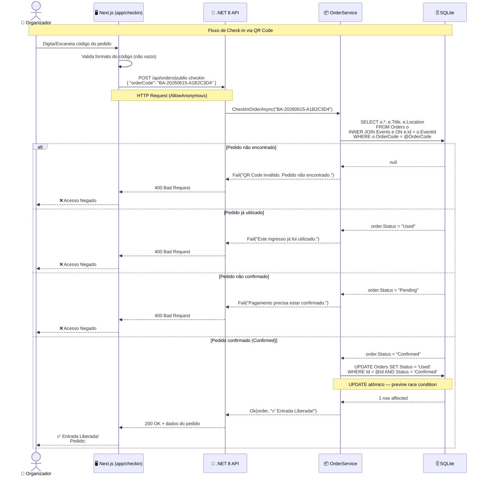
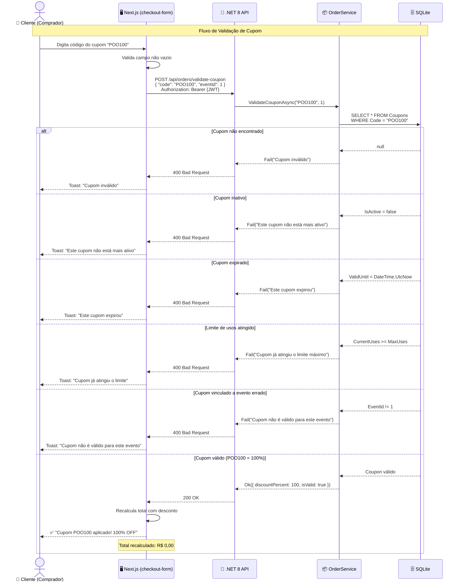
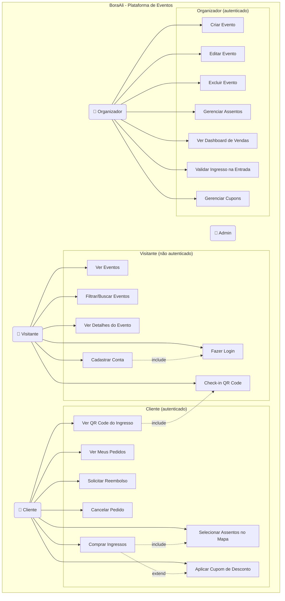
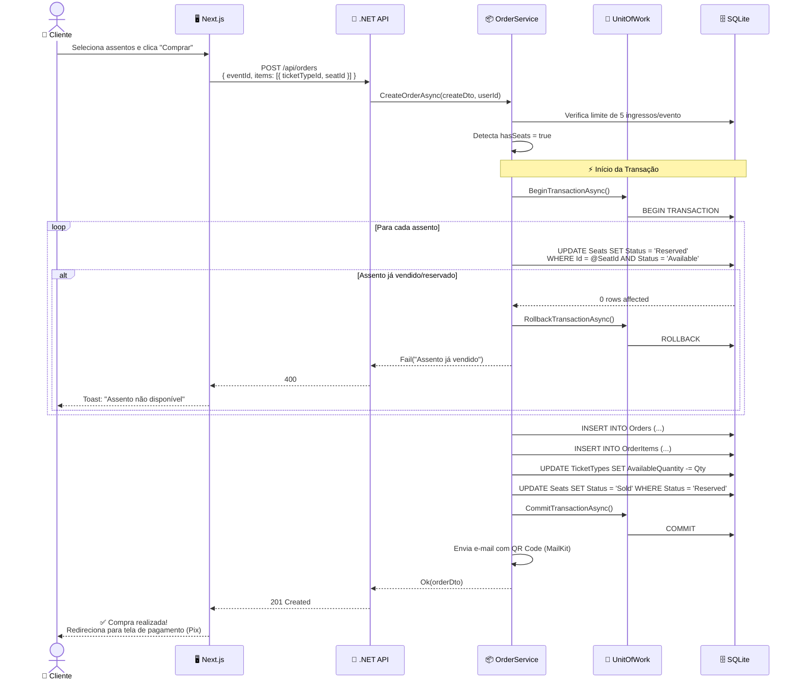
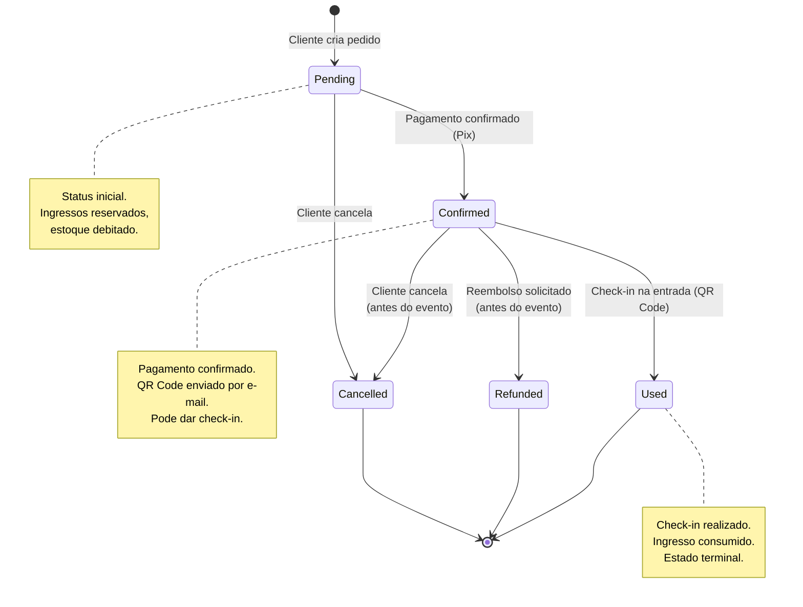

# Diagramas UML — BoraAli

> **Ferramenta:** Mermaid (renderizado nativamente no GitHub e VS Code)
> **Notação:** UML 2.5 — Diagramas de Sequência e Casos de Uso

---

## 1. Diagrama de Sequência: Check-in com QR Code

Este diagrama mostra o ciclo de vida completo da validação de um ingresso via QR Code na entrada do evento.

### Validações do Backend (Check-in)

| # | Validação | Código | HTTP Status |
|---|-----------|--------|-------------|
| 1 | Código do pedido existe? | `order == null` | 400 |
| 2 | Ingresso já foi utilizado? | `order.Status == "Used"` | 400 |
| 3 | Pagamento está confirmado? | `order.Status != "Confirmed"` | 400 |
| 4 | UPDATE atômico bem-sucedido? | `affected == 0` (race condition) | 400 |

---

## 2. Diagrama de Sequência: Validação de Cupons de Desconto

Este diagrama mostra o fluxo de validação de um cupom durante o checkout.

### Regras de Negócio do Cupom

| # | Regra | Campo/Validação |
|---|-------|-----------------|
| 1 | Cupom deve existir no banco | `Code == code.ToUpper().Trim()` |
| 2 | Cupom deve estar ativo | `IsActive == true` |
| 3 | Cupom não pode estar expirado | `ValidUntil == null \|\| ValidUntil >= DateTime.UtcNow` |
| 4 | Cupom não pode ter atingido limite | `CurrentUses < MaxUses` |
| 5 | Cupom deve ser global ou do evento | `EventId == null \|\| EventId == eventId` |

---

## 3. Diagrama de Casos de Uso

---

## 4. Diagrama de Sequência: Criação de Pedido com Assentos

Fluxo completo da compra com seleção de assentos, demonstrando concorrência segura.

---

## 5. Diagrama de Estados: Ciclo de Vida do Pedido

---

## Resumo das Validações Críticas do Backend

| Fluxo | Validação | Objetivo |
|-------|-----------|----------|
| **Check-in** | `UPDATE ... WHERE Status = 'Confirmed'` | Evita dupla entrada (idempotência) |
| **Compra com assentos** | `UPDATE Seats ... WHERE Status = 'Available'` | Evita venda do mesmo assento para 2 pessoas |
| **Compra com quantidade** | `UPDATE TicketTypes ... WHERE AvailableQuantity >= @Qty` | Evita overselling |
| **Cupom** | 5 verificações em sequência | Cupom válido, ativo, dentro do prazo, com usos restantes, compatível com o evento |
| **Reembolso** | `eventDate > DateTime.UtcNow` | Só reembolsa antes do evento acontecer |
| **Limite de ingressos** | `userTotalTickets + requested <= 5` | Máximo 5 ingressos por pessoa por evento |
