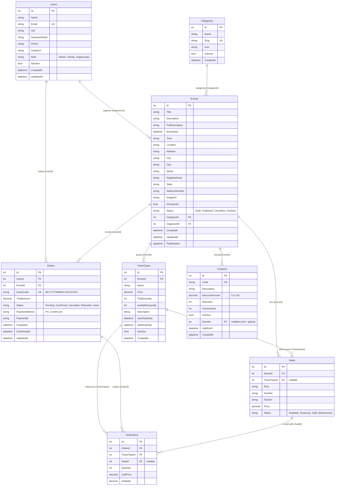
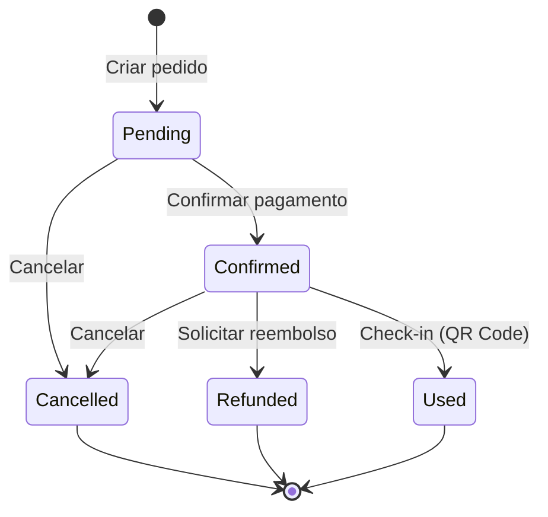

# Modelo Entidade-Relacionamento (MER) — BoraAli

> **Banco:** SQLite (via Dapper micro-ORM)
> **Diagrama:** Notação Crow's Foot (gerado com Mermaid)

---

## 1. Diagrama Entidade-Relacionamento



---

## 2. Dicionário de Dados — Estados (Status)

### 2.1. Event (`Events.Status`)

| Estado | Significado | Regras |
|--------|-------------|--------|
| **Draft** | Rascunho — evento em criação | Visível apenas para o organizador. Não aparece na listagem pública. Pode ser editado livremente. |
| **Published** | Publicado — visível e vendável | Aparece na home e nos resultados de busca. Aceita pedidos de compra. Pode ser editado (campos limitados). |
| **Cancelled** | Cancelado — não acontecerá mais | Sai da listagem pública. Pedidos existentes podem ser reembolsados. Não aceita novas compras. |
| **Finished** | Finalizado — evento já aconteceu | Permanece no histórico. Não aceita compras nem check-in. Usado para dashboards retrospectivos. |

### 2.2. Pedido (`Orders.Status`)

| Estado | Significado | Regras | Transições Válidas |
|--------|-------------|--------|-------------------|
| **Pending** | Aguardando pagamento | Ingressos reservados, estoque debitado. Cliente deve simular pagamento Pix. | → Confirmed, → Cancelled |
| **Confirmed** | Pagamento confirmado | QR Code enviado por e-mail. Pode dar check-in. Pode solicitar reembolso (antes do evento). | → Used, → Refunded, → Cancelled |
| **Cancelled** | Cancelado pelo cliente | Ingressos devolvidos ao estoque. Assentos liberados. Estado terminal. | (terminal) |
| **Refunded** | Reembolsado | Dinheiro devolvido. Ingressos e assentos liberados. Estado terminal. | (terminal) |
| **Used** | Check-in realizado | Ingresso consumido na entrada do evento. Não pode ser cancelado nem reembolsado. Estado terminal. | (terminal) |



### 2.3. Assento (`Seats.Status`)

| Estado | Significado | Regras |
|--------|-------------|--------|
| **Available** | Disponível para compra | Aparece como verde no mapa interativo. Pode ser reservado via UPDATE atômico. |
| **Reserved** | Reservado temporariamente | Durante a transação de compra. Se o pagamento falhar, volta para Available via rollback. |
| **Sold** | Vendido | Aparece como vermelho no mapa. Não pode ser comprado por outro cliente. |
| **Maintenance** | Em manutenção | Indisponível por razões operacionais. Não aparece ou aparece como cinza. |

### 2.4. Usuário (`Users.Role`)

| Role | Permissões |
|------|-----------|
| **Admin** | Acesso total. Pode gerenciar usuários, eventos, pedidos. |
| **Cliente** | Compra ingressos, vê pedidos, solicita reembolso, faz check-in. |
| **Organizador** | Cria/edita/exclui eventos, vê dashboard de vendas, gerencia assentos, valida ingressos na entrada. |

---

## 3. Cardinalidades e Relacionamentos

| Entidade A | Cardinalidade | Entidade B | Explicação |
|-----------|---------------|-----------|------------|
| Users | 1:N | Events | Um organizador cria vários eventos |
| Users | 1:N | Orders | Um cliente faz vários pedidos |
| Categories | 1:N | Events | Uma categoria agrupa vários eventos |
| Events | 1:N | TicketTypes | Um evento tem vários tipos de ingresso |
| Events | 1:N | Orders | Um evento recebe vários pedidos |
| Events | 1:N | Seats | Um evento tem vários assentos |
| Events | 1:N | Coupons | Um evento pode ter cupons exclusivos (opcional) |
| TicketTypes | 1:N | OrderItems | Um tipo de ingresso aparece em vários itens de pedido |
| TicketTypes | 1:N | Seats | Um tipo de ingresso define o preço de vários assentos |
| Orders | 1:N | OrderItems | Um pedido contém vários itens |
| Seats | 1:N | OrderItems | Um assento é reservado em um item de pedido (opcional) |

---

## 4. Índices e Constraints

### Índices (para performance de queries)

```sql
CREATE INDEX IX_Events_CategoryId ON Events(CategoryId);
CREATE INDEX IX_Events_OrganizerId ON Events(OrganizerId);
CREATE INDEX IX_Events_Status ON Events(Status);
CREATE INDEX IX_Events_City ON Events(City);
CREATE INDEX IX_TicketTypes_EventId ON TicketTypes(EventId);
CREATE INDEX IX_Orders_UserId ON Orders(UserId);
CREATE INDEX IX_Orders_EventId ON Orders(EventId);
CREATE INDEX IX_Orders_OrderCode ON Orders(OrderCode);
CREATE INDEX IX_OrderItems_OrderId ON OrderItems(OrderId);
CREATE INDEX IX_Seats_EventId ON Seats(EventId);
CREATE INDEX IX_Seats_EventId_Status ON Seats(EventId, Status);
CREATE INDEX IX_OrderItems_SeatId ON OrderItems(SeatId);
```

### Constraints (CHECK)

```sql
-- TicketTypes
CHECK (Price >= 0)
CHECK (AvailableQuantity >= 0 AND AvailableQuantity <= TotalQuantity)

-- Orders
CHECK (TotalAmount >= 0)
CHECK (Status IN ('Pending', 'Confirmed', 'Cancelled', 'Refunded', 'Used'))

-- Seats
CHECK (Price >= 0)
CHECK (Status IN ('Available', 'Reserved', 'Sold', 'Maintenance'))

-- Coupons
CHECK (DiscountPercent >= 0 AND DiscountPercent <= 100)
CHECK (CurrentUses >= 0 AND CurrentUses <= MaxUses)

-- Users
CHECK (Role IN ('Admin', 'Cliente', 'Organizador'))
CHECK (Email LIKE '%@%.%')
```

---

## 5. Queries Complexas com Dapper (Exemplos do Dashboard)

O dashboard de vendas do organizador usa **Dapper** para executar queries SQL com agregações (`SUM`, `COUNT`, `GROUP BY`):

### Receita total e ingressos vendidos

```sql
SELECT
    COALESCE(SUM(o.TotalAmount), 0) AS TotalRevenue,
    COALESCE(SUM(oi.Quantity), 0) AS TotalSold,
    COUNT(DISTINCT o.Id) AS TotalOrders
FROM Orders o
INNER JOIN OrderItems oi ON oi.OrderId = o.Id
INNER JOIN Events e ON e.Id = o.EventId
WHERE e.OrganizerId = @OrgId
  AND o.Status IN ('Confirmed', 'Used');
```

### Receita por tipo de ingresso (GROUP BY)

```sql
SELECT
    tt.Name,
    SUM(oi.Quantity) AS Sold,
    SUM(oi.Subtotal) AS Revenue
FROM OrderItems oi
INNER JOIN TicketTypes tt ON tt.Id = oi.TicketTypeId
INNER JOIN Orders o ON o.Id = oi.OrderId
INNER JOIN Events e ON e.Id = o.EventId
WHERE e.OrganizerId = @OrgId
  AND o.Status IN ('Confirmed', 'Used')
GROUP BY tt.Name
ORDER BY Revenue DESC;
```

### Receita por evento (GROUP BY)

```sql
SELECT
    e.Id AS EventId,
    e.Title AS Title,
    SUM(oi.Quantity) AS TicketsSold,
    SUM(o.TotalAmount) AS Revenue
FROM Orders o
INNER JOIN OrderItems oi ON oi.OrderId = o.Id
INNER JOIN Events e ON e.Id = o.EventId
WHERE e.OrganizerId = @OrgId
  AND o.Status IN ('Confirmed', 'Used')
GROUP BY e.Id, e.Title
ORDER BY Revenue DESC;
```
